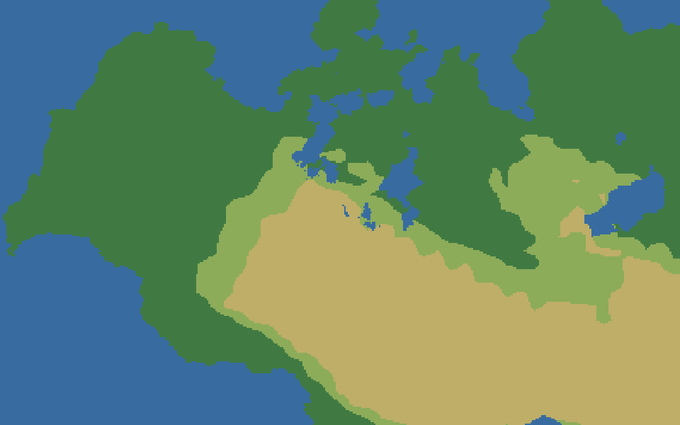
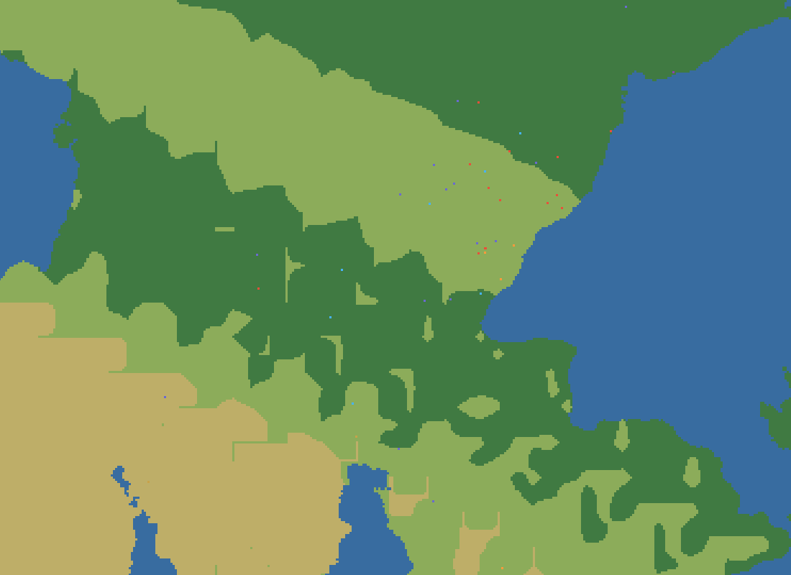

# Cairn

Cairn est un simulateur d'évolution culturelle et technologique. Un monde infini, généré à partir d'une seule graine, est peuplé d'humains simulés un par un : ils ont faim et soif, se souviennent de l'endroit où coule une source, se regroupent en clans, inventent le feu ou ne l'inventent jamais, et meurent en emportant parfois un savoir que personne d'autre ne possédait.

Il n'y a ni personnage à incarner, ni quête, ni victoire. Le joueur est une divinité qui observe et qui peut peser sur le monde (une pluie, un éclair, une terre rendue fertile), sans jamais donner d'ordre. Chaque intervention a son revers : bénir une vallée d'une pluie généreuse, c'est aussi la priver des incendies qui auraient appris le feu à ses habitants.



Le projet est écrit en Rust. Il me sert à apprendre le langage sur un sujet assez riche pour le mériter, et il a vocation à tourner à terme comme un serveur persistant, sur une machine modeste (2 vCPU, 2 Go de mémoire), observable depuis un client web compilé en WebAssembly.

## Le principe qui commande tout le reste

Rien n'est scripté. Les âges technologiques (paléolithique, néolithique, bronze) ne sont pas des paliers qu'on débloque : ce sont des étiquettes calculées après coup sur ce que les clans savent réellement faire. Un peuple peut stagner des milliers d'années parce que son climat ne l'y oblige pas ; un autre peut trouver le bronze en quelques siècles parce que le froid, la faim et un affleurement de cuivre croisé au bon moment l'y ont poussé.

Cette contrainte a un coût, qui est aussi l'intérêt du projet : quand un comportement n'apparaît pas, on ne peut pas l'écrire à la main. Il faut comprendre pourquoi les règles ne le produisent pas.

## Ce qui existe aujourd'hui

Le développement suit un plan en six phases, chacune avec ses critères d'acceptation (le détail est dans [docs/BRIEF.md](docs/BRIEF.md)). Les cinq premières sont en place.

Le sol d'abord. L'altitude vient d'un bruit fractal sous un masque continental, la température de la latitude et de l'altitude, puis l'humidité est transportée depuis les océans par les vents dominants et se déleste en franchissant le relief. Les déserts tombent donc sous le vent des montagnes, là où la physique les met. Les biomes suivent la classification de Whittaker, les rivières un calcul d'écoulement, et une couche géologique indépendante répartit silex, argile, cuivre et étain. Le cuivre et l'étain ne se trouvent jamais au même endroit : la distance médiane mesurée entre deux gisements est de 766 km, et sur sept graines les deux métaux se trouvent pourtant toujours sur une même masse de terre. L'âge du bronze passe donc forcément par le commerce, sans jamais être impossible.

Une tuile fait deux mètres. Une hutte en occupe plusieurs, un continent en compte plus d'un million de côté. Le monde est découpé en blocs de 64 × 64 tuiles générés à la demande et oubliés quand plus personne ne les regarde, ce qui le rend infini sans que la mémoire le soit.

Puis la vie : une végétation qui repousse selon une croissance logistique (calculée en forme fermée, ce qui permet de rattraper des semaines d'absence en un seul calcul), des troupeaux et des meutes en équilibre proie-prédateur, et des humains dont la physiologie, la mémoire spatiale et les traits hérités décident des choix. Ils se regroupent en clans quand la cohésion sociale et la proximité durable le justifient, bâtissent huttes, greniers et palissades, se razzient. Enfin l'innovation : un arbre technologique décrit en données, des découvertes qui dépendent de la curiosité, de la compétence, de ce que l'agent a déjà vu et de la pression que subit son clan, une transmission incertaine entre voisins, et l'oubli quand les derniers porteurs d'un savoir disparaissent.

La sixième phase est entamée. La Chronique raconte ce qui fait date (une découverte, la mort d'un chef, un incendie qu'un clan a vu passer), la divinité dispose de ses interventions, et une foi naît chez les clans qui ont vu le ciel répondre. Restent le serveur détaché, le réseau et la persistance.



Le client affiche aujourd'hui une simulation qui tourne localement dans le navigateur : terrain par couches, humains colorés selon leur activité, troupeaux et meutes, et un panneau d'inspection qui montre ce qu'un individu a en tête (ses besoins, la tâche qu'il poursuit, les motivations qu'il a écartées).

## La méthode, et pourquoi elle compte ici

Les défauts de ce projet ne font pas planter le programme. Ils produisent un monde plausible : des plaies qui ne tuent jamais, une végétation qui ne repousse plus après le passage d'un troupeau, une pression qui reste bloquée au maximum pendant vingt et un ans de jeu sans que personne n'invente rien. Un monde plausible et faux ne se voit pas à l'œil.

La discipline qui en découle tient en peu de règles, chacune née d'une erreur réelle. On mesure au lieu de déduire. On écrit ses prédictions avant de lancer le banc. On sépare chaque changement du suivant. On compare toujours à un témoin compilé avant la modification. On vérifie sur au moins quatre graines, parce qu'un système proie-prédateur lu sur une seule n'est qu'un tirage. Et on confronte deux compteurs indépendants qui doivent concorder, parce que c'est ainsi qu'on a découvert que la Chronique annonçait quarante-deux morts au combat quand la démographie n'enregistrait qu'une mort, de soif : aucune blessure mortelle ne tuait, la santé se régénérait dans le tick même où le coup l'avait mise à zéro.

Le dernier chantier en donne une idée. Les longues simulations s'effondraient vers la vingtième année de jeu, jusqu'à ne plus avancer que d'un cinquième de pas par seconde. Un profileur a montré que la faune pesait 85 % du temps de calcul. En mesurant sa croissance troupeau par troupeau, on a trouvé que rien ne la freinait : la consommation d'une bête était environ mille fois trop faible face à ce que produit le sol, si bien qu'une forêt tempérée aurait pu nourrir quarante-quatre mille cerfs au kilomètre carré (la réalité en porte une cinquantaine). Une fois la natalité rattachée à ce que le pays produit, les prédateurs, eux-mêmes calibrés soixante fois trop vite, ont dévoré un gibier qui ne les distançait plus. Puis l'aire occupée par la faune s'est mise à croître sans fin. Chaque correction a déplacé le problème d'un cran, et chaque fois c'est une mesure, pas une intuition, qui a désigné le suivant. Une tentative au moins a été annulée après coup : un périmètre qui retirait le gibier trop éloigné des humains vidait la zone qu'il devait borner, parce que les troupeaux fuient les hommes et que la fuite les poussait au bord.

Le journal complet de ces décisions, hypothèses réfutées comprises, est dans [docs/JOURNAL.md](docs/JOURNAL.md).

## Organisation du code

Le dépôt est un workspace Cargo de cinq crates, d'environ 23 000 lignes.

`cairn-core` porte le temps de jeu, l'échelle et un générateur pseudo-aléatoire dérivé de la graine globale. La simulation est déterministe bit à bit : deux exécutions sur la même machine donnent le même monde au pas près. Rien n'itère jamais sur une table de hachage.

`cairn-worldgen` est le monde de base, une fonction pure de la graine et des coordonnées. Il ne change jamais.

`cairn-sim` est tout ce qui évolue : les blocs de tuiles mutables, l'écologie, la faune, les agents et leur cerveau (une IA à utilité, où chaque motivation reçoit un score), les clans, l'innovation, la Chronique, la divinité. C'est aussi là que vivent les bancs de mesure.

`cairn-protocol` décrit ce que le serveur dira du monde. Il réutilise les types de la simulation au lieu de les recopier, ce qui rend une désynchronisation entre serveur et client impossible par construction ; le terrain n'y transite pas, puisque le client sait le régénérer depuis la graine.

`cairn-client` est le client web.

## Lancer le projet

Il faut une chaîne Rust récente (édition 2024). Les exemples se lancent toujours en `--release` : en mode débogage, la génération du monde est trop lente pour être utile.

```sh
cargo test                     # la suite de tests
cargo run --release -p cairn-worldgen --example map_png -- 42        # cartes du monde (PNG dans out/)
cargo run --release -p cairn-sim --example life_demo -- 42 1 40      # une population lâchée un an
cargo run --release -p cairn-sim --example etincelle -- 42 30        # trente ans dans un foyer froid, histoire technologique
cargo run --release -p cairn-client --example client_render -- 42    # rendu du client en PNG, sans navigateur
```

Le client web se construit avec `crates/client/build.sh`, qui demande la cible `wasm32-unknown-unknown` et `wasm-bindgen-cli` ; la marche à suivre est dans [crates/client/README.md](crates/client/README.md).

Les bancs d'analyse (`chronicle`, `derive`, `diagnose`, `eviction`) et leurs arguments sont décrits dans [CLAUDE.md](CLAUDE.md), qui tient aussi l'état courant du travail. Ce fichier sert de contexte à l'assistant avec lequel le projet est développé ; je le laisse public parce qu'il documente les règles et la méthode mieux que tout résumé.
