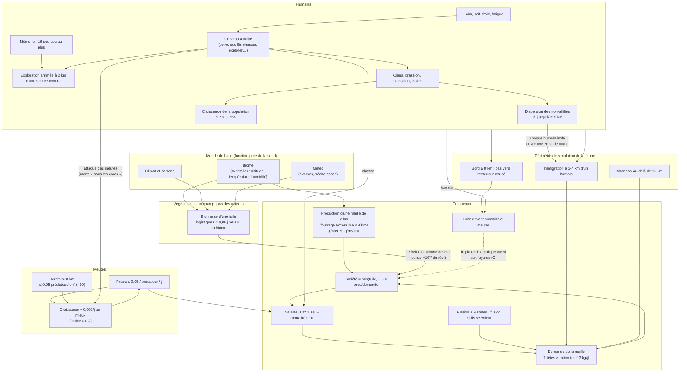
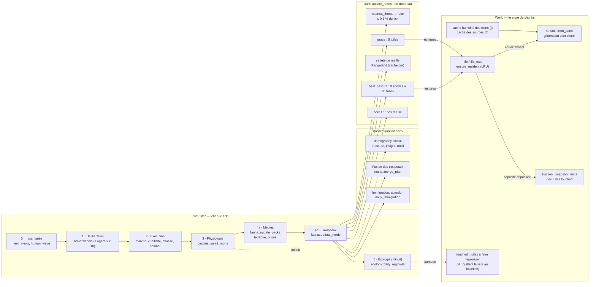
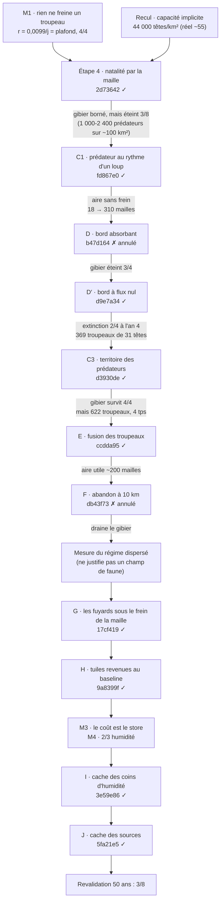

# Carte de Cairn — logique, fonctions, mesures, corrections

État au 2026-09-29 (`9e3b21b`). Document de reprise : ce qu'il faut avoir en tête avant de toucher à la simulation, et pourquoi chaque chose est comme elle est. Les chiffres viennent de mesures consignées dans [JOURNAL.md](JOURNAL.md) ; les données brutes sont dans `out/` (non versionné, local au serveur).

Lecture en quatre temps : la **logique** du monde (ce qui cause quoi), les **fonctions** qui la calculent à chaque tick (et ce qu'elles coûtent), les **corrections** apportées et leurs résultats, et ce qui **reste ouvert**.

---

## 1. Le graphe logique

Les boucles causales du modèle. Une flèche se lit « agit sur ». Les étiquettes portent les grandeurs mesurées ; `⚠` marque un défaut encore ouvert.

Ce que ce graphe dit, en clair :

- **La régulation du gibier passe par la maille de 2 km, pas par la tuile.** Une tête consomme 24 unités par jour quand une tuile de forêt en repousse 4,2 : la capacité implicite de la tuile était de ~44 000 têtes/km², mille fois le réel. D'où les quatre échecs de la régulation par le fourrage (moyenne des sondes, empreinte par tuile, réseau épars, agrégat par chunk). La satiété de maille donne ~55 cerfs/km² en forêt tempérée.
- **Le prédateur est borné par son territoire, pas seulement par sa proie.** Sans territoire, même au rythme d'un loup, il montait à 1,5-2/km² et le cycle proie-prédateur, non amorti, éteignait le gibier.
- **La faune n'existe que près des humains** (immigration à 1-4 km, bord à 8 km). Conséquence directe : ce que les humains font de l'espace (se disperser) dicte l'aire de faune simulée, donc son coût.
- **La pression d'innovation est saturée** (`crowding` = membres/40 pour des clans de 48) et **l'exploration est gelée dès l'an 1** (16 sources connues au plus, arrimage à 2 km). Ces deux défauts sont hors du périmètre du chantier de dérive ; ils attendent.

---

## 2. Le graphe fonctionnel

Ce que `Sim::step` exécute à chaque tick (1 tick = 1 heure de jeu), dans l'ordre, et ce que chaque étape coûte. Les coûts sont mesurés sous la feature `profile` sur le banc `derive`.

Ce qu'un tick coûte, et où — les mesures qui ont orienté les corrections :

| Poste | Mesure | Source |
|---|---|---|
| Faune dans le tick | 84,8 % avant tout correctif (derive, 600 j) | profileur, 2026-09-19 |
| Coût propre d'un troupeau | **12 à 32 µs par troupeau-tick** | M3 (régression, r² 0,83-0,97, 8 runs) |
| Coût d'un chunk régénéré | **1,68 à 1,84 ms** avant I | M3 |
| Part des régénérations dans le temps des troupeaux (jours < 20 tps) | **78 à 93 %** | M3 |
| Régénérations provoquées par les troupeaux | **62 à 91 %** de toutes | M3 |
| Décomposition d'un chunk généré (avant I) | humidité des coins **66-73 %** (~1 200 µs), sources ~120, allocation ~55, tuiles à la demande ~280 (160 tuiles × 1,8 µs) | M4, deux compteurs concordants |
| Après I et J | ~600-750 µs par chunk ; humidité 166-262 µs (coins jamais vus), sources 63-111 µs | M4 sur les runs de I et J |
| Écologie | 35 à 70 % du tick selon le run ; 200-400 ns par tuile visitée, qu'elle ait à repousser ou non ; ~50 % des tuiles visitées déjà au baseline | mesure de l'écologie (`touched_census`) |
| Requêtes de voisinage (fuite, meutes) | ≤ 0,1 % du tick sur 16 runs — la grille spatiale est inutile | M2-faune |

---

## 3. Les corrections et leurs résultats

Chaque correction a suivi le même protocole : témoin figé avant, prédictions écrites avant, test de reproduction vu échouer d'abord, banc sur 4 seeds, verdict face aux prédictions. Les empreintes sont celles de l'historique réécrit le 2026-09-28.

| Correction | Ce qu'elle change | Résultat mesuré |
|---|---|---|
| Balayage épars (`92ef903`) | la repousse ne visite que les tuiles touchées | ×5,4 sur 600 j, trajectoire identique |
| Sondes de pâture (`5fee653`) | 80 → 20 tuiles, plus neuf chunks par tick | ×3,6 sur 4 seeds |
| Pluie (`5099f8c`, `0fe2f20`) | la pousse de pluie est enregistrée, puis se résorbe | cliquet → réservoir |
| **Étape 4** (`2d73642`) | satiété = min(tuile, 0,5 × production/demande de la maille) | plus aucun `SANS BORNE` 8/8 ; mais gibier éteint 3/8 |
| **C1** (`fd867e0`) | prises 0,18 → 0,05, rendement 0,55 → 0,42 : +0,001/j au mieux | pic de prédateurs 82-208 contre 1 242-2 048 ; gibier vivant 4/4 à 540 j |
| D (`b47d164`, annulé) | retirer le gibier à > 8 km des humains | gibier éteint 3/4 : bord absorbant |
| **D′** (`d9e7a34`) | pas vers l'extérieur refusé au-delà de 8 km ; abandon à 16 km | aire bornée 4/4 à 5 ans |
| **C3** (`d3930de`) | territoire 8 km, ≤ 0,05 prédateur/km² ; fission des meutes 24 → 8 | prédateurs 42-67 contre 188-410 ; gibier vivant 4/4 à 5 ans |
| **E** (`ccdda95`) | fusion de deux troupeaux sauvages qui se voient | troupeaux ÷ 2 à 3, ~60 têtes chacun ; plancher ×1,3 à ×2,6 |
| F (`db43f73`, annulé) | abandon à 10 km | aire bornée mais gibier drainé (éteint sur 2024) |
| **G** (`17cf419`) | le plafond de maille s'applique aussi aux fuyards | seed 42 : 1 003 387 → 12 616 têtes à 5 ans |
| **H** (`9a8399f`) | une tuile revenue au baseline quitte `touched` | trajectoire identique ; écologie −22 à −39 % ; débit +7 à +24 % |
| **I** (`3e59e86`) | cache des coins d'humidité | trajectoire identique ; humidité par chunk ÷ 5 ; débit +45 à +54 % |
| **J** (`5fa21e5`) | la génération lit le cache des sources | trajectoire identique ; débit +1 à +9 % |

### Contre l'objectif (≥ 20 tps chaque année, 50 ans, 4 seeds, `chronicle` et `etincelle`)

| Run | Première validation (`ceb06c2`) | Revalidation (`bc94f7d`) |
|---|---|---|
| etincelle 42 | 29,8 ✓ | **42,5 ✓** |
| etincelle 1337 | 35,3 ✓ | **36,7 ✓** |
| chronicle 7 | 26,0 ✓ | **20,7 ✓** |
| chronicle 42 | 8,7 ✗ | 15,9 ✗ |
| etincelle 7 | 6,2 ✗ | 11,5 ✗ |
| chronicle 1337 | 5,6 ✗ | 5,4 ✗ |
| etincelle 2024 | 1,8 ✗ (arrêtée) | 2,6 ✗ (arrêtée) |
| chronicle 2024 | 0,8 ✗ (arrêtée) | 4,6 ✗ (arrêtée) |

Mémoire de pointe : 1,06 à 1,28 Go sur les runs saines ; **2,32 Go** (chronicle 2024), 1,56 et 1,52 Go ailleurs — au-delà de la limite de 1,5 Go.

---

## 4. Ce qui reste ouvert

Rattaché aux nœuds du graphe logique :

1. **Dispersion humaine** (`DISP`) — seed 2024 : habitants à 215 km en moyenne, 1 400 troupeaux, 2,32 Go. Touche au comportement des humains, donc à l'émergence : décision de conception à prendre.
2. **Croissance humaine** (`POP`) — chronicle 1337 : 386 habitants à l'an 48, groupés, 308 troupeaux, 5,4 tps. Non mesuré : la part des humains et de la faune dans ce tick.
3. **Mémoire qui suit la surface visitée** — caches et instantanés non bornés (sources, `last_regrowth`, `deltas`). À mesurer.
4. **Faune à l'équilibre encore chère** — etincelle 7 : 311 troupeaux, 11,5 tps.
5. **Éviction non transparente** — un chunk évincé rattrape sa repousse en une forme fermée à minuit : 70 % des tuiles broutées diffèrent à 30 j entre deux capacités. La capacité fait partie de la définition d'un monde ; à corriger avant la persistance de la Phase 6.
6. **Hors du chantier de dérive** : pression d'innovation saturée ; exploration gelée dès l'an 1 ; exposition au cuivre jamais atteinte.
